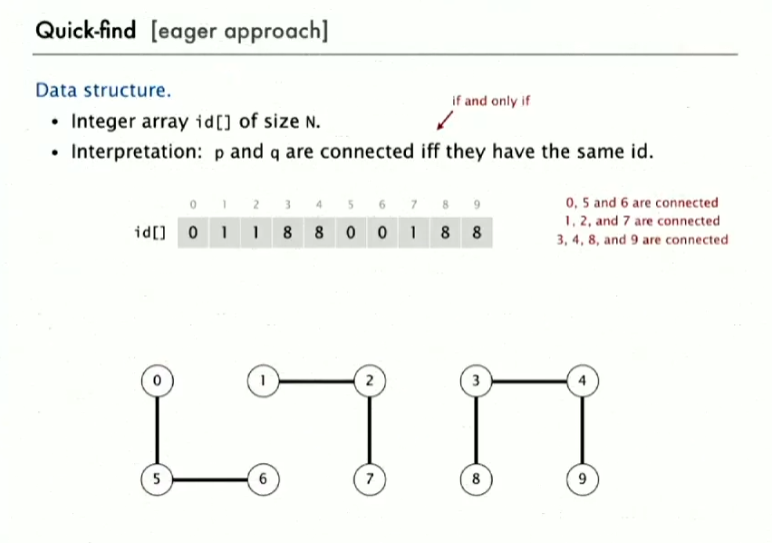
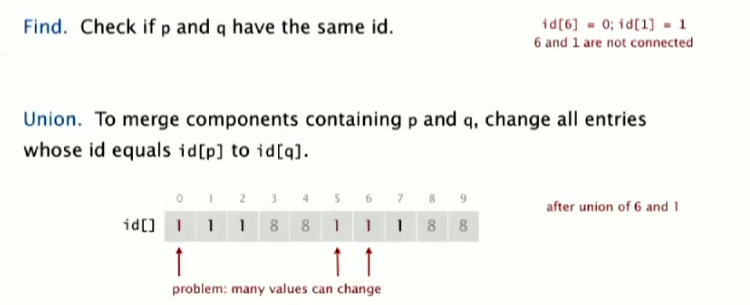
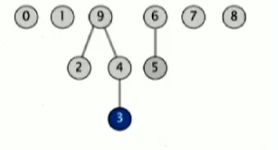
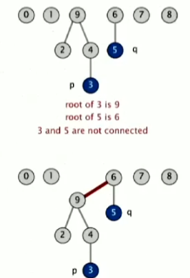
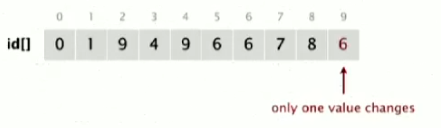

# 并查集 Union Find

1. Union Command
2. Find(Connected) Query

**Application**

Network, Transistor in computer chip...

**What is connectivity**

Reflexive, Symmetric and transitive (equivalence relation)

**Implementing the operations**

1. Find query
2. Union command

**Quick-find \[eager approach]**





Find的话很简单，如果p和q对应的id的value是一样的，那么就说明他们是connected的。

Union的话，需要把所有的ID改成一样的（比如上图是Union(6,1) 所有和6ID相同，也就是所有ID为0 的全部变成0）。可能会有很多..但是很好实现。

**Implementation**

```java
public class QuickFindUF {
    private int[] id;
    public QuickFindUF(int N) {
        id = new int[N];
        for (int i = 0; i < N; i++) {
            id[i] = i;
            // set id of each object to itself
            // N array accesses
        }
    }
    publiCc boolean connected(int p, int q) {
        return id[p] == id[q];
        // check whether p and q are in the same component
        // 2 array accesses
    }
    public void union(int p, int q) {
        int pid = id[p];
        int qid = id[q];
        for (int i = 0; i <id.length, i++) 
            if (id[i] == pid) id[i] = qid;
        // change all entries with id[p] to id[q]
        // at most 2N + 2 array accesses
    }
}
```

1. Constructor假设所有的object散作满天星，即赋予每个object遍历的i当做值就好。
2. connected直接检测p, q2个object是否ID相同
3.  Union的话，要先做一个temp来储存即将消失的值（此处为pid），然后将所有等于p的id的值改为qid即可。

    时间复杂度：find是O(1)，数组的access是O(1)，其他都是显而易见的O(N)。特别是union，可能过于high-cost了。

**Quick-union \[lazy approach]**

1. 用同样的数据结构，依然是一个id\[]。
2. 但是Interpretation不一样，id\[i] is parent of i。整体结构像一个森林。
3. i的根部只要不停地取i的id即可。例：id\[id\[id\[...id\[i]...]]]. 如果id\[i] = i，说明是root不是嘛。



**Implementation**

1. Find: Check if p and q have the same root
2.  Union: To merge components containing p and q, set the id of p's root to the id of q's root

    这种Union的实现只需要改变一个value。






1. Constructor是一样的，依然是赋值0 到N-1
2. 增加一个新的函数，用一个while函数不停寻找root，返回指定值的root。
3. Connect的话是调用root，找到root即可
4.  Union的话，Union(p, q)的话，先用root找到p和q的root，再把p的root改成q的root。

    ```java
    public class QuickUnionUF {
        private int[] id;
        public QuickUnionUF(int N) {
            id = new int[N];
            for (int i = 0; i < N; i++) id[i] = 1;
            // Set id of each object to itself (N array accesses)
        }
        private int root(int i) {
            while(id[i] != i) {
                i = id[i];
            }
            return i;
            // Chase parent pointers until reach root (depth of array accesses)
        }
        public boolean connected(int p, int q) {
            return root(p) == root(q);
        }
        public void union (int p, int q) {
            int i = root(p);
            int j = root(q);
            id[i] = j;
            // change root of p to point to root of q
            // depth of p and q array accesses
        }
        
    }
    ```

无论是root，connected还是union，复杂度都取决于pq2个object的深度。虽然比上个快。，但是还是太慢咯。

| Algorithm   | initialize | union                              | find           |
| ----------- | ---------- | ---------------------------------- | -------------- |
| quick-find  | N          | N                                  | 1              |
| quick-union | N          | N (includes cost of finding roots) | N (Worst case) |

比起上次的话，tree太tall的话，find太过expensive。

#### Union Improvements

要来真的了。

**Improvement 1: Weighting**

1.  Find 是一样的。

    ```java
    return root(p) == root(q);
    ```
2. 数据结构需要增加一个sz\[i]，来计算以i为root的树的大小(number of objects in the tree rooted at i)
3.  Union需要改一下 。一般来说，union的时候，从小树的根，link到大树的根上

    ```java
    int i = root(p);
    int j = root(q);
    if (i == j) return;
    if (sz[i] < sz[j]) {
        id[i] = j;
        sz[j] += sz[i];
    } else {
        id[j] = i;
        sz[i] += sz[j];
    }
    ```

**Running time**

Find: Take time proportion al to depth of p and q.

Union: Takes constatnt time, give roots.

**Proposition**

Depth of ANY node $x$ is at most $lg{ N}$

| Algorithm   | initialize | union                                 | find           |
| ----------- | ---------- | ------------------------------------- | -------------- |
| quick-find  | N          | N                                     | 1              |
| quick-union | N          | N (includes cost of finding roots)    | N (Worst case) |
| weighted QU | N          | lg N (includes cost of finding roots) | lg N           |

**Path Compression**

Just after computing the root of p, set the id of each examined node to point to that root.

**Two-pass Implementation**

add second loop to root() to set the id\[] of each examined node to the root.

**Simpler one- pass variant**

Make every other node in the path point to its grandparent, thereby halving path length.

```java
private int root(int i) {
    while (i != id[i]) {
        id[i] = id[id[i]];
        i = id[i];
    }
    return i;
}
```


#### C++ Implementation

```clike
vector<int> id;
vector<int> sz;// sizes of forest when current nodes as root
void buildUF(int N) {
        for (int i = 0; i < N; i++) {
            id.push_back(i);
            sz.push_back(1);
        }
    }
    int root(int i) {
        while (i != id [i]) {
            
            id[i] = id[id[i]];// path compression here
            i = id[i];
        }  
        return i;
    }
    bool isConnectedUnion(int p, int q) {
        return root(p) == root(q);
    }
    void unionTwo(int p, int q) {
        int i = root(p);
        int j = root(q);
        if (i == j) return;
        if (sz[i]<sz[j]) {
            sz[j] += sz[i];
            id[i] = j;
        } else {
            sz[i] += sz[j];
            id[j] = i;
        }
    }
```

[**547. 省份数量**](https://leetcode-cn.com/problems/number-of-provinces/)

```clike
class Solution {
    vector<int> id;
    vector<int> sz;// sizes of forest when current nodes as root
    
public:
    int findCircleNum(vector<vector<int>>& isConnected) {
        if (isConnected.size() == 0 ) return 0;
  
        buildUF(isConnected.size());
        int counter =isConnected.size();
        for (int m = 0; m < isConnected.size(); m++) { 
            for (int n = 0; n < m;n++) { 
                // 这里我之前写的是n < isConnected.size()， 虽然也是对的，但是其实作为一个相对的关系，只需要<m即可。剩下的都会是重复结论
                if (m!=n && isConnected[m][n] == 1) {
                    unionTwo(m,n, counter);
                }
            }
        }
        return counter;
    }
private:
    void buildUF(int N) {
        for (int i = 0; i < N; i++) {
            id.push_back(i);
            sz.push_back(1);
        }
    }
    int root(int i) {
        while (i != id [i]) {
            // path compression here
            id[i] = id[id[i]];
            i = id[i];
        }  
        return i;
    }
    bool isConnectedUnion(int p, int q) {
        return root(p) == root(q);
    }
     void unionTwo(int p, int q, int& counter) {
        int i = root(p);
        int j = root(q);
        if (i == j) return;
        if (sz[i]<sz[j]) {
            id[i] = j;
            sz[j] += sz[i];
        } else {
            id[j] = i;
            sz[i] += sz[j];
        }
        counter--;
    }
    
};
```

[**323. 无向图中连通分量的数目**](https://leetcode-cn.com/problems/number-of-connected-components-in-an-undirected-graph/)

```clike
class Solution {
    
public:
    int countComponents(int n, vector<vector<int>>& edges) {
        for (int i = 0; i < n; i++) {
            id.push_back(i); // set the id table for union find functions
            sz.push_back(0);
        }
        int res =  n;
        for (int i = 0; i < edges.size(); i++) {
            unionNode(edges[i][0],edges[i][1], res);
        }
        return res;
    }
private:
    vector<int> id;

    vector<int> sz; // calculate the size of the forest
    int root(int i) {
        while (i != id[i]) {
            id[i] = id[id[i]];
            i = id[i];
        }
        return i;
    }
    void unionNode(int p, int q, int& res) {
        int i = root(p);
        int j = root(q);
        if (i == j) return;
        if (sz[i]< sz[j]) {
            sz[j] += sz[i];
            id[i] = j;
        }  else {
           sz[i] += sz[j];
           id[j] = i;
        }
        
        res--;
    }
};
```

也算是也不算是做了一些优化，只是把constructor写到了函数内部罢了。删除了不需要的isconnected。但是我不觉得面试官会在乎这些优化罢了。

[**200. 岛屿数量**](https://leetcode-cn.com/problems/number-of-islands/)

```clike
class Solution {
public:
    int numIslands(vector<vector<char>>& grid) {
        int m = grid.size();
        int n = grid[0].size();
        int counter = m*n;
        int water = 0;
        
        // build UF table here;
        for (int i = 0; i < m*n; i++) {
            id.push_back(i);
            sz.push_back(1);
        }
        for (int i = 0; i < m; i++) {
            for(int j = 0; j <n; j++) {
                if (grid[i][j] == '0') water++;
                if (i+1<m) { // check horizontally
                    if (grid[i][j] == '1' && grid[i+1][j] == '1') {
                        // cout<<i <<"and" <<j<<endl;
                        cout<<i*m+j <<"unite " <<i*m+j+n<<endl;
                        unionIsland(i*n+j, i*n+j+n,counter);
						
                    }
                }
                if (j+1<n) { // check vertically
                    if (grid[i][j] == '1' && grid[i][j+1] == '1') {
                        unionIsland(i*n+j, i*n+j+1,counter);
                        //cout<<i*m+j <<"unite" <<i*m+j+1<<endl;
                    }
                }
            }
        }
        return counter-water;;
    }
private:
    vector<int> id; // UF table
    vector<int> sz;
    int root(int i) {
        while(i != id[i]) {
            id[i] = id[id[i]]; // path compression
            i = id[i];
        }
        return i;
    }
    void unionIsland(int p, int q, int& counter) {
        int i = root(p);
        int j = root(q);
        if (i == j) return;
        // weight improvement 
        if (sz[i] < sz[j]) {
            sz[j] += sz[i];
            id[i] = j;
        } else {
            sz[i] +=sz[j];
            id[j] = i;
        }
        counter--;
    }

};
```

[**261. Graph Valid Tree**](https://leetcode-cn.com/problems/graph-valid-tree/)

```clike
class Solution {
public:
    bool validTree(int n, vector<vector<int>>& edges) {
        for(int i = 0; i<n;i++) {
            sz.push_back(1);
            id.push_back(i);
        }
        counter = n;
        for(auto nodePair:edges) {
            
            if (unionFind(nodePair[0], nodePair[1]) == false ) return false;
        }
        if (counter != 1) return false;
        return true;
    }   

private:
    vector<int> sz;
    vector<int> id;
    int counter;
    int root(int i) {
        if (i != id[i]) {
            // path compression cannot be done here.. it may erase the cycle
            id[i] = id[id[i]];
            i = id[i];
        }
         return i;
    }
    bool unionFind (int p, int q) {
        int i = root(p);
        int j = root(q);
        if (i == j) {
            cout<<"same root";
            return false;
        }
        if (sz[i]<sz[j]) {
            sz[j]+= sz[i];
            id[i] = j;
        } else {
            sz[i] += sz[j];
            id[j] = i;
        }
        counter--;
        return true;
    }
};
```

