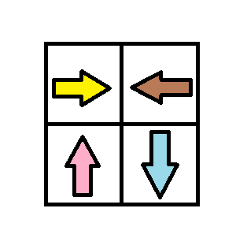

# 1368. 使网格图至少有一条有效路径的最小代价

给你一个 m x n 的网格图 `grid` 。 `grid` 中每个格子都有一个数字，对应着从该格子出发下一步走的方向。 `grid[i][j]` 中的数字可能为以下几种情况：

* **1** ，下一步往右走，也就是你会从 `grid[i][j]` 走到 `grid[i][j + 1]`
* **2** ，下一步往左走，也就是你会从 `grid[i][j]` 走到 `grid[i][j - 1]`
* **3** ，下一步往下走，也就是你会从 `grid[i][j]` 走到 `grid[i + 1][j]`
* **4** ，下一步往上走，也就是你会从 `grid[i][j]` 走到 `grid[i - 1][j]`

注意网格图中可能会有 **无效数字** ，因为它们可能指向 `grid` 以外的区域。

一开始，你会从最左上角的格子 `(0,0)` 出发。我们定义一条 **有效路径** 为从格子 `(0,0)` 出发，每一步都顺着数字对应方向走，最终在最右下角的格子 `(m - 1, n - 1)` 结束的路径。有效路径 **不需要是最短路径** 。

你可以花费 `cost = 1` 的代价修改一个格子中的数字，但每个格子中的数字 **只能修改一次** 。

请你返回让网格图至少有一条有效路径的最小代价。

**示例 1：**

 (1).png>)

```
输入：grid = [[1,1,1,1],[2,2,2,2],[1,1,1,1],[2,2,2,2]]输出：3解释：你将从点 (0, 0) 出发。到达 (3, 3) 的路径为： (0, 0) --> (0, 1) --> (0, 2) --> (0, 3) 花费代价 cost = 1 使方向向下 --> (1, 3) --> (1, 2) --> (1, 1) --> (1, 0) 花费代价 cost = 1 使方向向下 --> (2, 0) --> (2, 1) --> (2, 2) --> (2, 3) 花费代价 cost = 1 使方向向下 --> (3, 3)总花费为 cost = 3.
```

**示例 2：**

 (1).png>)

```
输入：grid = [[1,1,3],[3,2,2],[1,1,4]]
输出：0
解释：不修改任何数字你就可以从 (0, 0) 到达 (2, 2) 。
```

**示例 3：**




```
输入：grid = [[1,2],[4,3]]
输出：1
```

**示例 4：**

```
输入：grid = [[2,2,2],[2,2,2]]
输出：3
```

**示例 5：**

```
输入：grid = [[4]]
输出：0
```

这道题有很多办法。

1. Dijkstra Algorithm
2. 01BFS的三种实现
   1. 2个queue，一个存1，一个存0
   2. Deque，1存后，0存前
   3. 1个queue，2次遍历

最优解是：

```cpp
class Solution {
public:
    int dx[4] = {0, 0, 1, -1};
    int dy[4] = {1, -1 , 0, 0};
    int minCost(vector<vector<int>>& grid) {
        int m = grid.size(), n = grid[0].size();
        vector<vector<bool>> visited(m, vector<bool>(n, false));
        deque<tuple<int, int, int>> dq {make_tuple(0, 0, 0)}; // x y and current lvl
        while (!dq.empty()) {
            auto [x, y, lvl] = dq.front(); 
            dq.pop_front();
            // 用三元组方便计算当前的lvl，也就是path的长度  
            if (visited[x][y]) continue;
            if (x == m - 1 && y == n -1) return lvl;
            visited[x][y] = true;
            for(int k = 0; k < 4; k++) {
                int ax = x + dx[k], ay = y + dy[k];
                if (ax >= 0 && ay >= 0 && ax < m && ay < n && !visited[ax][ay]) {
                    if (grid[x][y] == k + 1) { 
                        // 这里 我人工modify了dx dy2个向量数组的顺序，使得k + 1刚好和x y的方向吻合 不然要做很多无所谓的判断
                        dq.push_front(make_tuple(ax, ay, lvl));
                    } else dq.push_back(make_tuple(ax, ay, lvl + 1)); // 方向不一样就加cost
                    
                    
                }
            }
        }
        return 0; // 实际永远有解~ 写多少都行
    }
};
```

其实这里的Deque模拟了一个priority queue。

和BFS的区别是mark 是否visited的位置是不一样的。是没法在循环里，看到时候mark的，而是要在queue里mark。

其他方法配合

[https://leetcode-cn.com/problems/minimum-cost-to-make-at-least-one-valid-path-in-a-grid/solution/zui-duan-lu-jing-suan-fa-bfs0-1bfsdijkstra-by-luci/](https://leetcode-cn.com/problems/minimum-cost-to-make-at-least-one-valid-path-in-a-grid/solution/zui-duan-lu-jing-suan-fa-bfs0-1bfsdijkstra-by-luci/)

食用

\
