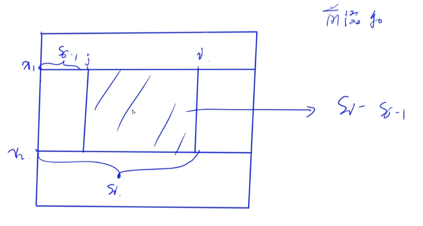
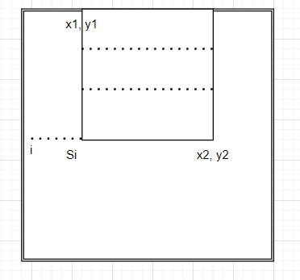

# 363. 矩形区域不超过 K 的最大数值和

[**363. 矩形区域不超过 K 的最大数值和**](https://leetcode-cn.com/problems/max-sum-of-rectangle-no-larger-than-k/)

给你一个 `m x n` 的矩阵 `matrix` 和一个整数 `k` ，找出并返回矩阵内部矩形区域的不超过 `k` 的最大数值和。

题目数据保证总会存在一个数值和不超过 `k` 的矩形区域。

**示例 1：**


```
输入：matrix = [[1,0,1],[0,-2,3]], k = 2
输出：2
解释：蓝色边框圈出来的矩形区域 [[0, 1], [-2, 3]] 的数值和是 2，
且 2 是不超过 k 的最大数字（k = 2）。
```

**示例 2：**

```
输入：matrix = [[2,2,-1]], k = 3
输出：3
```

**提示：**

* `m == matrix.length`
* `n == matrix[i].length`
* `1 <= m, n <= 100`
* `-100 <= matrix[i][j] <= 100`
* `-105 <= k <= 105`

**进阶：**如果行数远大于列数，该如何设计解决方案？

**方法一：暴力二维前缀和**

时间复杂度：O(m^2\*n^2)

枚举所有可能的矩形，再用O(1)复杂度通过预处理好的二维前缀和进行计算。不再赘述。

Leetcode的话vector会被卡，改成普通数组可以过（甚至击败90%，迷惑..）。。

```cpp
class Solution {
public:
    int prefix[105][105];
    int maxSumSubmatrix(vector<vector<int>>& matrix, int t) {
        int res = INT_MIN;
        int m = matrix.size();
        int n = matrix[0].size();
        
        for (int i = 1; i <= m; i++) {
            for (int j = 1; j <= n; j++) {
                prefix[i][j] = prefix[i - 1][j] + prefix[i][j - 1] - prefix[i - 1][j - 1] + matrix[i - 1][j - 1];
            }
        }
        
        for (int i = 1; i <= m; i++) {
            for (int j = 1; j <= n; j++) {
                for (int k = 0; k < i; k++) {
                    for (int l = 0; l < j; l++) {
                        int cur = prefix[i][j] - prefix[k][j] - prefix[i][l] + prefix[k][l];
                        if (cur <= t) res = max(res, cur);
                    }
                }
            }
        }
        return res;
    }
};
```

#### 方法二：降维枚举

同样预处理出二维前缀和。

但是比起一一枚举4个维度（左上角xy轴和右下角xy轴），其实只需要枚举三个维护，最后一个维度可以用二分查找的思想。

当我们确定了三条边之后，剩下的只需要讨论第四条边的坐标即可。

如何用更低的复杂度求解虚线的位置是本体的难点。



上图中，有S\_i - S\_{j-1} <= k

求左侧最大值即可。即找到S\_{j-1} \geq S\_i的最小值，用平衡树即可。

```cpp
class Solution {
public:    
    int maxSumSubmatrix(vector<vector<int>>& matrix, int k) {
        int res = INT_MIN;
        int m = matrix.size();
        int n = matrix[0].size();
        vector<vector<int>> prefix(m + 1, vector<int> (n + 1));
        // 预处理前缀和
        for (int i = 1; i <= m; i++) {
            for (int j = 1; j <= n; j++) {
                prefix[i][j] = prefix[i - 1][j] + prefix[i][j - 1] - prefix[i - 1][j - 1] + matrix[i - 1][j - 1];
            }
        }
        // 计算子矩阵和
        auto getSum = [&](int x1, int y1, int x2, int y2) {
            assert(x1 >= 1);
            assert(y1 >= 1);
            return prefix[x2][y2] - prefix[x1 - 1][y2] - prefix[x2][y1 - 1] + prefix[x1 - 1][y1 - 1];
        };

        for (int x1 = 1; x1 <= m; x1++) {
            for (int x2 = x1; x2 <= m; x2++) {
                set<int> s; // 所有左侧左边界的可能取值
                s.insert(0);
                for (int y2 = 1; y2 <= n; y2++) {
                    int cur = getSum(x1, 1, x2, y2); //得到S_i的值
                    auto it = s.lower_bound(cur - k);
                    if (it != s.end()) res = max(res, cur - *it);
                    s.insert(cur);
                }
            }
        }
        
        
        return res;
    }
};
```

这题既可以二分出最后一行也可以二分出最后一列，但是本题的进阶问题是行数远比列数多的时候。因此我们可以选择二分出最后一行而不是列。



```cpp
class Solution {
public:    
    int maxSumSubmatrix(vector<vector<int>>& matrix, int k) {
        int res = INT_MIN;
        int m = matrix.size();
        int n = matrix[0].size();
        vector<vector<int>> prefix(m + 1, vector<int> (n + 1));
        // 预处理前缀和
        for (int i = 1; i <= m; i++) {
            for (int j = 1; j <= n; j++) {
                prefix[i][j] = prefix[i - 1][j] + prefix[i][j - 1] - prefix[i - 1][j - 1] + matrix[i - 1][j - 1];
            }
        }
        // 计算子矩阵和
        auto getSum = [&](int x1, int y1, int x2, int y2) {
            assert(x1 >= 1);
            assert(y1 >= 1);
            return prefix[x2][y2] - prefix[x1 - 1][y2] - prefix[x2][y1 - 1] + prefix[x1 - 1][y1 - 1];
        };

        for (int y1 = 1; y1 <= n; y1++) {
            for (int y2 = y1; y2 <= n; y2++) {
                set<int> s; 
                s.insert(0);
                for (int x2 = 1; x2 <= m; x2++) {
                    int cur = getSum(1, y1, x2, y2); //得到S_i的值
                    auto it = s.lower_bound(cur - k);
                    if (it != s.end()) res = max(res, cur - *it);
                    s.insert(cur);
                }
            }
        }
        
        
        return res;
    }
};
```
